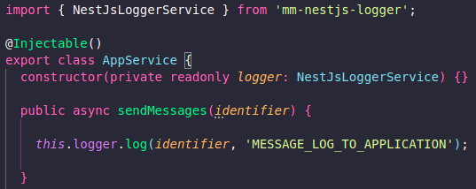

# Nest Js Logger

## Índice

- [Descrição](#descrição)
- [Configurações](#configurações)

  - [Instalar a biblioteca](#instalar-a-biblioteca)
  - [Variáveis de ambiente](#variáveis-de-ambiente)
  - [Configurando a biblioteca](#configurando-a-biblioteca)
  - [Utilizando a biblioteca](#utilizando-a-biblioteca)
    - [Exemplo de utilização da biblioteca](#exemplo-de-utilização-da-biblioteca)
- [Contrato das funções de disparo de logs](#contrato-das-funções-de-disparo-de-logs)
- [Contribuições](#contribuições)

## Descrição

O Nest Js Logger é uma biblioteca inner source para facilitar e padronizar a forma de trabalho dos logs em projetos nestjs na madeiramadeira, seguindo as regras do MMRFC.

## Configurações

### Instalar a biblioteca

Para usar a biblioteca, você precisa instalar utilizando NPM ou YARN:

###### YARN

```bash
$ yarn add nest-js-logger
```

###### NPM

```bash
$ npm install git+ssh://git@github.com:madeiramadeirabr/nest-js-logger.git
```

### Variáveis de ambiente

Será necessário inserir a seguinte variável de ambiente em um arquivo .env na raiz do projeto, a depender do ambiente que está desenvolvendo:

- `APPLICATION_ENV=staging`
  ou
- `APPLICATION_ENV=production`

### Configurando a biblioteca

Caso o projeto possua seu nome em uma variável de ambiente nas secrets da madeiramadeira com a chave `NEW_RELIC_APP_NAME`, siga as instruções do `MODO 1`, senão, siga as instruções de configuração do `MODO 2`.

###### Modo 1

No arquivo `app.module`, insira o código abaixo:

```bash
Module({
  imports: [ NestJsLoggerModule ]
})
```

###### Modo 2

No arquivo `app.module`, insira o código abaixo:

```bash
Module({
  imports: [
    NestJsLoggerModule.forRoot({
      defaultMeta: {
        service_name: "service_name", // Não é necessário caso já passe via NEW_RELIC_APP_NAME
      }
    })
  ] 
})
```

### Utilizando a biblioteca

Após realizado o passo anterior será necessário importar o NestJsLoggerModule nos sub-modulos do projeto onde contêm os services que irão usar a biblioteca:

```bash
Module({
  imports : [ NestJsLoggerModule ]
})
```

Com a biblioteca instalada e todas as configurações feitas, será necessário importá-la nos arquivos onde serão feitos os logs, injetar a dependência e em seguida chamá-la passando o evento a ser enviado.

```bash
$ import { NestJsLoggerService } from 'nest-js-logger';
```

```bash
@Injectable()
export class ExampleService {
  constructor(
    private readonly logger: NestJsLoggerService,
  ) { }
```

Exemplo de uso passando o evento a ser enviado para a NewRelic como um log do tipo warn:

```bash
this.logger.warn(identifier, ContextLoggerEnum.PRODUCT_HUB_PRODUCT_SERVICE_GET_FAILED_MESSAGE);
```

###### Exemplo de utilização da biblioteca



## Contrato das funções de disparo de logs

A biblioteca criará logs com padrão MMRFC com os seguintes modelos de resposta:

```bash
error(message: any, context?: string): void; // Equivalente a error no winston

log(message: any, context?: string): void; // Equivalente a info no winston

warn(message: any, context?: string): void; // Equivalente a warn no winston

debug(message: any, context?: string): void; // Equivalente a debug no winston
```

## Contribuições

[Catalog](https://github.com/orgs/madeiramadeirabr/teams/squad-catalog-admin)

- [Pedro Fellipe Melo](https://github.com/PedroFellipe)
- [Felipe Jhordan](https://github.com/FelipeJhordan)
- [Camila Damásio](https://github.com/CamilaDamasio)
